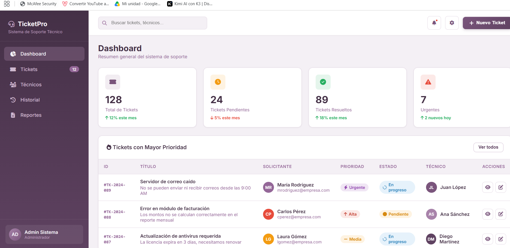
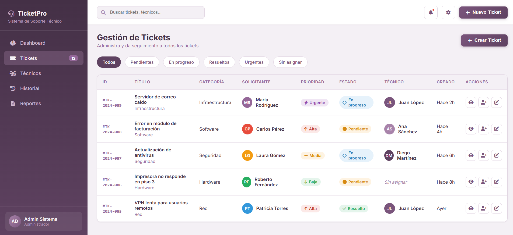
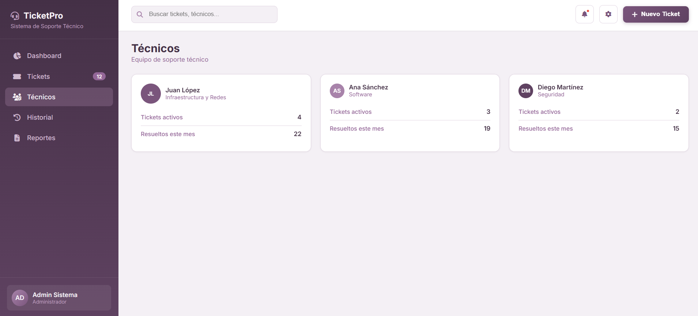
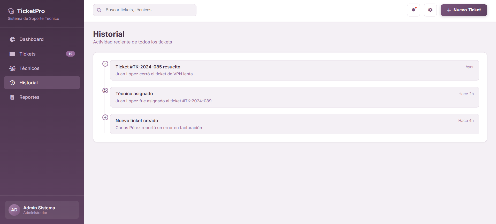
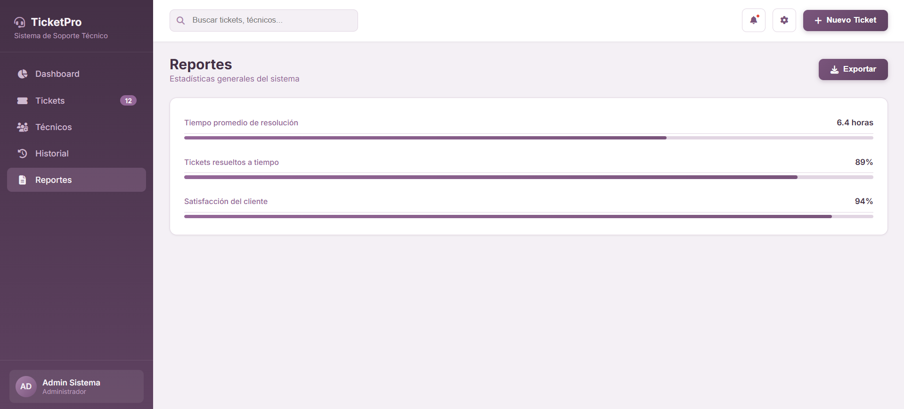

# TicketPro - Sistema de Tickets de Soporte

Sistema de gestión de tickets de soporte técnico con dashboard, chat interno, asignación de técnicos y reportes.

## Descripción

TicketPro es una interfaz web para administrar solicitudes de soporte técnico. Permite visualizar estadísticas generales, dar seguimiento a los tickets, asignar técnicos y comunicarse mediante un chat interno por cada ticket.

## Funcionalidades

- Dashboard con estadísticas generales (total de tickets, pendientes, resueltos y urgentes)
- Listado de tickets con filtros por estado
- Vista de detalle de cada ticket con chat interno
- Sección de técnicos con tickets activos y resueltos
- Historial de actividad reciente
- Reportes con tiempo promedio de resolución y satisfacción del cliente
- Formulario para crear nuevos tickets

## Tecnologías

- HTML5
- CSS3
- JavaScript

## Cómo usarlo

1. Cloná el repositorio
git clone https://github.com/cvanessa-dev/ticket-system.git

2. Abrí la carpeta en VS Code
3. Abrí el archivo `Index.html` con la extensión Live Server para visualizarlo en el navegador

## Estado del proyecto

En desarrollo. Algunas funcionalidades como la búsqueda y la asignación de técnicos aún están en construcción.

## Capturas de pantalla

### Dashboard

### Tickets

### Técnicos

### Historial

### Reportes

## Autora

Vanessa Rodríguez